# chatbot-Q-A

Upload your PDF documents and get instant answers using our AI-powered chatbot.

## Features

- 📄 Upload one or more PDF files
- 🔍 Intelligent text extraction using **pdfplumber**
- 🧠 Semantic search powered by **FAISS** vector store and **OpenAI Embeddings**
- 💬 Conversational Q&A with chat history via **LangChain** + **OpenAI GPT**
- 🖥️ Clean, interactive UI built with **Streamlit**

---

## Architecture & Workflow

The diagram below shows the end-to-end sequence — from a user uploading a PDF to receiving a grounded answer.

```mermaid
flowchart LR
    A(["👤 User"])
    B["🖥️ Streamlit UI\n(sidebar uploader)"]
    C["📄 pdfplumber\n(text extraction)"]
    D["✂️ RecursiveCharacter\nTextSplitter\nchunk=1000 / overlap=200"]
    E["🔢 OpenAI\nEmbeddings"]
    F[("🗄️ FAISS\nVector DB")]
    G(["❓ User Question"])
    H["🔍 Similarity\nSearch\ntop-4 chunks"]
    I["📝 LCEL Chain\nChatPromptTemplate\n+ chat_history"]
    J["🤖 ChatOpenAI\ngpt-3.5-turbo"]
    K["💬 Streamlit\nChat Bubble"]

    A -->|"① Upload PDF"| B
    B -->|"② Read bytes"| C
    C -->|"③ Raw text"| D
    D -->|"④ Chunks"| E
    E -->|"⑤ Vectors"| F

    G -->|"⑥ Embed question"| H
    F -->|"Index"| H
    H -->|"⑦ Context chunks"| I
    G -->|"⑦ Question"| I
    I -->|"⑧ Formatted prompt"| J
    J -->|"⑨ Answer"| K
```



---

## Key Concepts Used (Beginner-Friendly)

| # | Concept | What it means in this project |
|---|---------|-------------------------------|
| 1 | **Large Language Model (LLM)** | GPT-3.5-turbo reads context + question and writes a human-like answer |
| 2 | **Embeddings** | Numbers (vectors) that represent the *meaning* of text so similar ideas end up near each other in space |
| 3 | **Vector Store / Index** | A fast database (FAISS) that stores embeddings and finds the most similar ones to a query in milliseconds |
| 4 | **Retrieval-Augmented Generation (RAG)** | Instead of relying on the LLM's training data alone, we *retrieve* relevant chunks from the PDF and *augment* the prompt with them before *generating* an answer |
| 5 | **Text Chunking** | Long documents are split into smaller pieces so embeddings stay focused and retrieval stays precise |
| 6 | **LCEL (LangChain Expression Language)** | A pipe-based syntax (`chain = step1 \| step2 \| step3`) for composing LangChain components into a runnable pipeline |
| 7 | **Session State** | Streamlit re-runs the entire script on every interaction; `st.session_state` is the dictionary that persists objects (like the vector store) between re-runs |
| 8 | **Environment Variables** | Secrets (e.g. the OpenAI API key) are kept out of source code in a `.env` file and loaded at runtime with `python-dotenv` |
| 9 | **Prompt Engineering** | Crafting the system message that instructs the model to answer *only* from the provided context, reducing hallucinations |
| 10 | **Conversational Memory** | Past `HumanMessage`/`AIMessage` pairs are passed to the chain on every turn so the model maintains context across the conversation |

---

## Python vs C# — Concept Comparison

The table below lists each concept used in this project with a brief description, guidance on when to use it, and a short code example for both Python and C#.

| # | Concept | What it is | When to use it | Python (this project) | C# equivalent |
|---|---------|-----------|----------------|----------------------|---------------|
| 1 | **Package Manager** | Downloads and manages third-party libraries | Every time you add a library or reproduce a project's dependencies | `pip install -r requirements.txt` | `dotnet restore` (NuGet) |
| 2 | **Virtual Environment** | Isolated Python installation scoped to one project | Always — before installing packages, to avoid version conflicts across projects | `python -m venv .venv` then `source .venv/bin/activate` | No activation step needed; `.csproj` isolates each project automatically |
| 3 | **Environment Variables / Secrets** | Config kept outside source code (API keys, connection strings) | Whenever the code needs secrets — never hard-code credentials | `load_dotenv()` → `os.getenv("OPENAI_API_KEY")` | `config["OpenAI:ApiKey"]` via `IConfiguration` + `appsettings.json` |
| 4 | **LLM API Client** | Library that handles auth & HTTP calls to the OpenAI API | Sending prompts to a language model and receiving generated text | `ChatOpenAI(model="gpt-3.5-turbo").invoke([HumanMessage(...)])` | `new OpenAIClient(key).GetChatCompletionsAsync(opts)` (`Azure.AI.OpenAI`) |
| 5 | **Vector Store** | Database that stores embedding vectors and finds nearest neighbours | RAG pipelines — store document chunks as vectors, retrieve most relevant ones | `FAISS.from_texts(chunks, embedding=embeddings)` | `new SemanticTextMemory(new VolatileMemoryStore(), embeddingService)` |
| 6 | **LLM Orchestration / Pipeline** | Chains retrieval → prompt → LLM → parser into one reusable pipeline | Multi-step AI workflows where output of one step feeds the next | `chain = retriever \| prompt \| llm \| StrOutputParser()` (LCEL) | `kernel.InvokeAsync(fn, new KernelArguments{...})` (Semantic Kernel) |
| 7 | **Web UI Framework** | Turns code into an interactive web app with minimal boilerplate | Data apps, demos, or internal tools without writing HTML/CSS/JS | `streamlit run app.py` + `st.chat_input(...)` | Blazor: `@page "/chat"` + `<InputFile OnChange="HandleFile" />` |
| 8 | **Session State** | Persists objects across multiple user interactions in the same session | Caching expensive objects (like a vector index) to avoid rebuilding on every action | `st.session_state["vector_store"] = build_faiss_index(chunks)` | Blazor scoped service: `@inject AppState State` / `State.VectorStore` |
| 9 | **Type System** | Declares expected data types for variables and function signatures | Always — catches bugs at development time and improves IDE support | `def build_chain(chunks: List[str]) -> str:` (optional hints) | `string BuildChain(List<string> chunks)` (enforced by compiler) |
| 10 | **Async / Non-blocking I/O** | Lets the program continue working while waiting for a slow operation | Calling external APIs (OpenAI, databases) so the server stays responsive | `async def get_answer(): await llm.ainvoke([...])` | `async Task<string> GetAnswerAsync() { await client.GetChatCompletionsAsync(...) }` |
| 11 | **Collection Processing** | Concise syntax to transform, filter, and aggregate lists | Processing chunks, messages, or search results | `[c for c in chunks if c.strip()]` (list comprehension) | `chunks.Where(c => !string.IsNullOrWhiteSpace(c)).ToList()` (LINQ) |

---

## Prerequisites

- Python 3.9 or higher
- An [OpenAI API key](https://platform.openai.com/account/api-keys)

---

## Setup

1. **Clone the repository**

   ```bash
   git clone https://github.com/nuthanm/chatbot-Q-A.git
   cd chatbot-Q-A
   ```

2. **Create and activate a virtual environment**

   > **Why a virtual environment?**
   > A virtual environment creates an isolated Python installation for this project.
   > This prevents dependency version conflicts between different projects on the same
   > machine — for example, if another project needs `openai==1.x` while this one
   > requires `openai==2.x`. It also keeps your global Python installation clean.

   ```bash
   # Create the virtual environment inside a folder called .venv
   python -m venv .venv
   ```

   ```bash
   # Activate on Windows (Command Prompt / PowerShell)
   .venv\Scripts\activate
   ```

   ```bash
   # Activate on macOS / Linux
   source .venv/bin/activate
   ```

   > Once activated, your terminal prompt will show `(.venv)` — all `pip install`
   > commands will now install packages only into this isolated environment.

3. **Install dependencies**

   ```bash
   # Install all pinned packages listed in requirements.txt
   pip install -r requirements.txt
   ```

4. **Configure your OpenAI API key**

   ```bash
   # Copy the template — never commit the real .env file
   cp .env.example .env

   # for windows
   copy .env.example .env
   ```

   Open `.env` in any editor and replace the placeholder with your actual key:

   ```
   OPENAI_API_KEY=sk-...
   ```

---

## Running the App

```bash
# Streamlit starts a local web server and opens the app in your browser
streamlit run app.py
```

The app will open automatically in your default browser at `http://localhost:8501`.

---

## How to Use

1. **Upload PDFs** – Use the sidebar to upload one or more PDF files.
2. **Process** – Click **Process PDFs** to extract text and build the search index.
3. **Ask questions** – Type your question in the chat input at the bottom of the page.
4. **Clear chat** – Use the **Clear Chat** button in the sidebar to reset the conversation.

---

## Tech Stack

| Library | Version | Official Docs | Purpose |
|---|---|---|---|
| [Streamlit](https://streamlit.io/) | 1.52.2 | [docs.streamlit.io](https://docs.streamlit.io) | Web UI |
| [pdfplumber](https://github.com/jsvine/pdfplumber) | 0.11.8 | [github.com/jsvine/pdfplumber](https://github.com/jsvine/pdfplumber) | PDF text extraction |
| [LangChain](https://www.langchain.com/) | 1.2.0 | [python.langchain.com](https://python.langchain.com/docs/introduction/) | LLM orchestration |
| [langchain-openai](https://pypi.org/project/langchain-openai/) | 1.1.6 | [api.python.langchain.com](https://api.python.langchain.com/en/latest/langchain_openai.html) | OpenAI LLM & embeddings |
| [langchain-community](https://pypi.org/project/langchain-community/) | 0.4.1 | [python.langchain.com/docs/integrations](https://python.langchain.com/docs/integrations/providers/) | FAISS vector store integration |
| [langchain-core](https://pypi.org/project/langchain-core/) | 1.2.5 | [api.python.langchain.com](https://api.python.langchain.com/en/latest/core_api_reference.html) | Core LangChain interfaces (LCEL) |
| [langchain-text-splitters](https://pypi.org/project/langchain-text-splitters/) | 1.1.0 | [python.langchain.com/docs/concepts/text_splitters](https://python.langchain.com/docs/concepts/text_splitters/) | Document chunking |
| [OpenAI Python SDK](https://github.com/openai/openai-python) | 2.14.0 | [platform.openai.com/docs](https://platform.openai.com/docs/introduction) | OpenAI API client |
| [faiss-cpu](https://github.com/facebookresearch/faiss) | 1.13.2 | [faiss.ai](https://faiss.ai/) | Vector similarity search |
| [tiktoken](https://github.com/openai/tiktoken) | 0.12.0 | [github.com/openai/tiktoken](https://github.com/openai/tiktoken) | Token counting |
| [python-dotenv](https://github.com/theskumar/python-dotenv) | 1.0.1 | [saurabh-kumar.com/python-dotenv](https://saurabh-kumar.com/python-dotenv/) | Load `.env` secrets |

---

## Learning Resource

This project was built following concepts taught in the course:

> 🎓 **[Generative AI for Beginners](https://deloittedevelopment.udemy.com/course/generative-ai-for-beginners-b/learn/)** — Udemy

---

## 🚀 Free Public Deployment Guide

You can host this app publicly at **zero cost** using any of the platforms below.
The app code requires **no changes** for any of these options.

> ⚠️ **Important:** The **hosting** is free, but every question you ask goes through the **OpenAI API**, which is a paid service. You will need your own [OpenAI API key](https://platform.openai.com/account/api-keys) and will be billed by OpenAI for API usage (typically fractions of a cent per question on `gpt-3.5-turbo`).

---

### ✅ Option 1 — Streamlit Community Cloud (Recommended)

The easiest option. Streamlit's own cloud platform is free, requires no Docker or server config, and is purpose-built for Streamlit apps.

**Steps:**

1. **Push your code to a public GitHub repository** (already done if you forked/cloned this repo).

2. **Sign up** at [share.streamlit.io](https://share.streamlit.io) using your GitHub account.

3. Click **"New app"** and fill in:
   - **Repository:** `nuthanm/chatbot-Q-A` (or your fork)
   - **Branch:** `main`
   - **Main file path:** `app.py`

4. **Add your OpenAI API key as a Secret:**
   - Click **"Advanced settings"** → **"Secrets"**
   - Paste the following (replace with your real key):
     ```toml
     OPENAI_API_KEY = "sk-..."
     ```

5. Click **"Deploy"**. Your app will be live at a URL like:
   ```
   https://<your-app-name>.streamlit.app
   ```

**Why this works without code changes:**
Streamlit Community Cloud injects secrets as environment variables. `langchain_openai` reads `OPENAI_API_KEY` directly from the environment, so everything wires up automatically. The `load_dotenv()` call in `app.py` is harmlessly skipped (no `.env` file exists on the server).

| Limit | Free tier |
|---|---|
| Apps | 3 public apps |
| Memory | 1 GB RAM |
| CPU | Shared |
| Sleep | App sleeps after inactivity (wakes on first visit) |

---

### 🤗 Option 2 — Hugging Face Spaces (Alternative)

Hugging Face Spaces also supports Streamlit apps for free with a persistent URL.

**Steps:**

1. **Sign up** at [huggingface.co](https://huggingface.co/join).

2. Go to **Spaces** → **"Create new Space"** and choose:
   - **SDK:** Streamlit
   - **Visibility:** Public (required for free tier)

3. **Push your files** to the Space repository (it's a Git repo):
   ```bash
   git remote add space https://huggingface.co/spaces/<your-username>/<space-name>
   git push space main
   ```

4. **Add your OpenAI API key as a Secret:**
   - In your Space → **Settings** → **Repository secrets**
   - Add `OPENAI_API_KEY` = `sk-...`

5. The Space will build automatically and give you a public URL:
   ```
   https://huggingface.co/spaces/<your-username>/<space-name>
   ```

| Limit | Free tier |
|---|---|
| CPU | 2 vCPU, 16 GB RAM |
| Sleep | Pauses after 48 h of inactivity |
| Storage | 50 GB |

---

### 🟣 Option 3 — Render.com (Alternative)

Render can host any Python web service. It takes a few more steps but gives you more control.

**Steps:**

1. **Sign up** at [render.com](https://render.com) with your GitHub account.

2. Click **"New +"** → **"Web Service"** → connect your GitHub repo.

3. Fill in:
   - **Runtime:** Python 3
   - **Build command:** `pip install -r requirements.txt`
   - **Start command:** `streamlit run app.py --server.port $PORT --server.address 0.0.0.0`

4. Under **"Environment"**, add:
   - Key: `OPENAI_API_KEY`  Value: `sk-...`

5. Choose the **Free** instance type and click **"Create Web Service"**.

Your app will be live at `https://<your-app-name>.onrender.com`.

| Limit | Free tier |
|---|---|
| RAM | 512 MB |
| CPU | Shared (0.1 CPU) |
| Sleep | Spins down after 15 min inactivity (cold start ~30 s) |
| Hours | 750 free hours/month |

---

### 🔑 Keeping Your API Key Safe

No matter which platform you use, **never commit your real API key to Git**.

- ✅ Use the platform's **Secrets / Environment Variables** panel (shown above for each option).
- ✅ Keep `.env` in `.gitignore` (already done in this repo).
- ❌ Never paste `sk-...` directly into `app.py` or `requirements.txt`.

---

### 📊 Platform Comparison

| Platform | Setup Difficulty | Free Tier | Best For |
|---|---|---|---|
| **Streamlit Community Cloud** | ⭐ Easiest | ✅ Yes | Streamlit apps — zero config |
| **Hugging Face Spaces** | ⭐⭐ Easy | ✅ Yes | AI/ML demos, larger RAM |
| **Render.com** | ⭐⭐⭐ Medium | ✅ Yes (with sleep) | General Python web services |

> 💡 **Recommendation:** Use **Streamlit Community Cloud** for the quickest, zero-friction deployment of this app.
